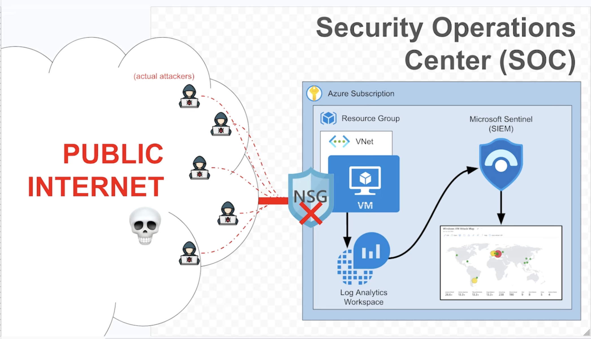
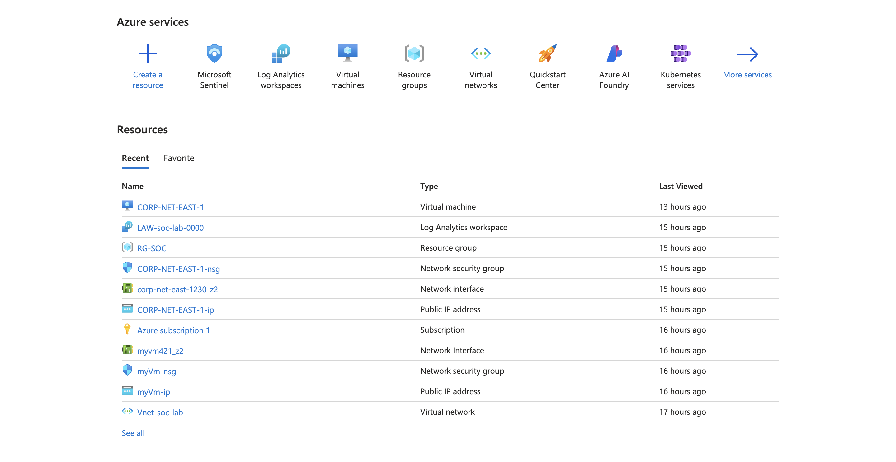
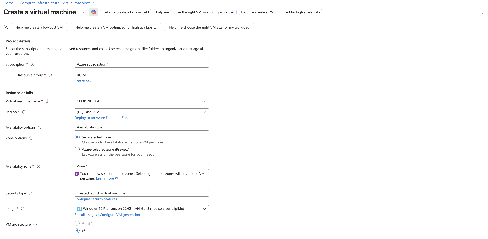
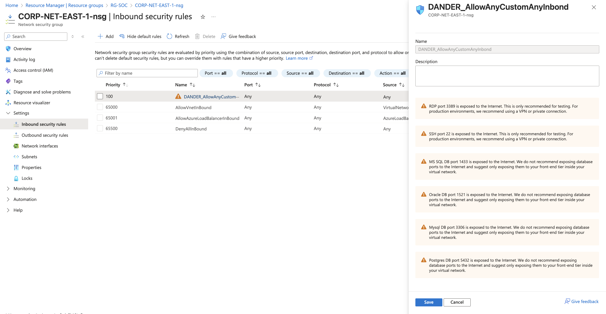
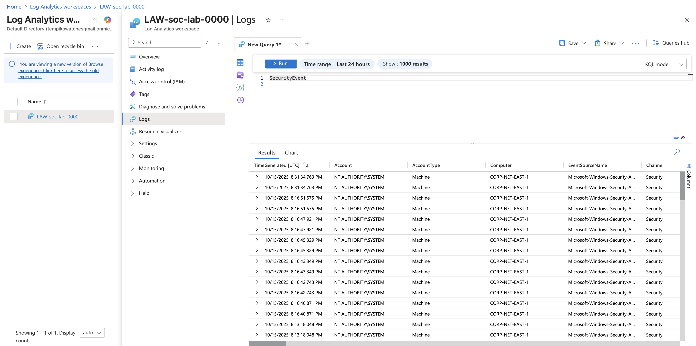
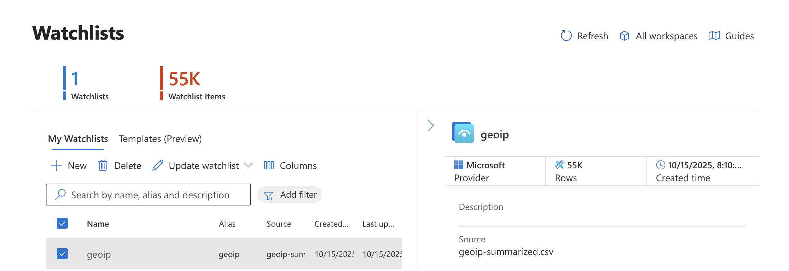
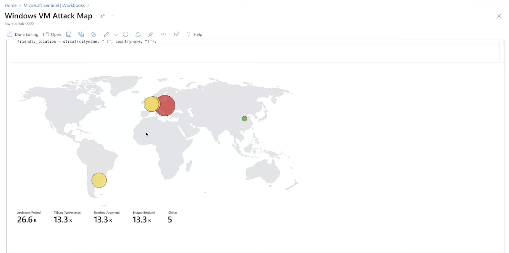

# 🛰️ Microsoft Sentinel Home Lab

A step-by-step guided project for building a **Microsoft Sentinel SIEM Home Lab** from scratch.  
This lab walks through setting up Azure, deploying a honeypot virtual machine, collecting security logs, forwarding them to Log Analytics, enriching them with geolocation data, and visualizing attacks in a Sentinel workbook.

---

## 📋 Table of Contents

1. [Overview](#overview)
2. [Architecture](#architecture)
3. [Lab Objectives](#lab-objectives)
4. [Prerequisites](#prerequisites)
5. [Part 1 – Azure Subscription Setup](#part-1-azure-subscription-setup)
6. [Part 2 – Creating the Honeypot VM](#part-2-creating-the-honeypot-vm)
7. [Part 3 – Logging into the VM & Inspecting Logs](#part-3-logging-into-the-vm-inspecting-logs)
8. [Part 4 – Log Forwarding & KQL](#part-4-log-forwarding--kql)
9. [Part 5 – Log Enrichment & Location Data](#part-5-log-enrichment--location-data)
10. [Part 6 – Attack Map Workbook](#part-6-attack-map-workbook)
11. [Sample KQL Queries](#sample-kql-queries)
12. [Cost Optimization Tips](#cost-optimization-tips)
13. [Results](#results)
14. [References & Resources](#references-resources)

---

## 🧠 Overview

This project demonstrates how to deploy and use **Microsoft Sentinel** for threat detection and security monitoring using Azure resources.

By the end of the lab, you will:
- Understand Sentinel architecture.
- Configure log collection and forwarding.
- Enrich logs with geographic data.
- Visualize attacker IPs on a live map.
- Query and analyze security events with **KQL**.

---

## 🏗️ Architecture

    [Attacker] ─▶ [Azure VM (Honeypot)]
    │
    ▼
    [Log Analytics Workspace (LAW)]
    │
    ▼
    [Microsoft Sentinel SIEM]
    │
    ▼
    [Workbook: Attack Map]



---

## 🎯 Lab Objectives

1. Create and configure Azure subscription and resources.
2. Deploy a vulnerable Windows 10 honeypot VM.
3. Generate and collect security logs.
4. Connect Microsoft Sentinel to Log Analytics.
5. Import and join IP geolocation data.
6. Build a live **attack map** dashboard in Sentinel.

---
## ⚙️ Prerequisites

Before you begin, make sure you have:

- A valid [Azure account](https://azure.microsoft.com/en-us/free)
- Basic familiarity with the Azure Portal
- Remote Desktop (RDP) access for connecting to the VM

---

## 🧩 Part 1 – Azure Subscription Setup

1. Create a free or paid Azure Subscription  
   🔗 [Create Free Azure Account](https://azure.microsoft.com/en-us/pricing/purchase-options/azure-account)
2. Sign in to the Azure Portal:  
   🔗 [https://portal.azure.com](https://portal.azure.com)
### 🖥️ Azure Portal

---

## 💻 Part 2 – Creating the Honeypot VM

### 💻 VM Creation

1. Go to **Virtual Machines** → **Create a new Windows 10 VM**.  
2. Choose an appropriate VM size (B1s or B2s for cost efficiency).  
3. Record your **username and password**.  
4. Go to your VM’s **Network Security Group (NSG)** → Allow **All Inbound Traffic**.
6. Connect to your VM → disable Windows Firewall (`wf.msc → Properties → All Off`).

### 🔐 NSG Rules


> ⚠️ The VM will be publicly accessible; treat it as a **honeypot**, not for personal use.

---

## 🔍 Part 3 – Logging into the VM & Inspecting Logs

1. Attempt 3 failed logins as user `employee`.  
2. Successfully log in as your actual user.  
3. Open **Event Viewer → Security Logs**.  
4. Look for **Event ID 4625 (Failed Logon)**.

---

## 📊 Part 4 – Log Forwarding & KQL

1. Create a **Log Analytics Workspace (LAW)**.  
2. Create a **Microsoft Sentinel instance** and connect it to the LAW.  
3. Configure **Windows Security Events via AMA** connector.  
4. Create a **Data Collection Rule (DCR)**.  
5. Verify data ingestion with:

```kql
SecurityEvent
| where EventID == 4625
| order by TimeGenerated desc
```
### 📊 Log Analytics Workspace


---

## 🌍 Part 5 – Log Enrichment & Location Data

After forwarding your logs to Microsoft Sentinel, you can enrich them with **geolocation data** to identify where attacker IPs are originating from.

### 1. Download the GeoIP Data File
Download the summarized GeoIP dataset:

🔗 [resources/geoip-summarized.csv](resources/geoip-summarized.csv)

### 2. Import the GeoIP File as a Watchlist

In **Microsoft Sentinel**, navigate to:

> Configuration → Watchlists → + Add new

**Use the following settings:**

| Setting | Value |
|----------|--------|
| **Name/Alias** | `geoip` |
| **Source Type** | Local File |
| **Search Key** | `network` |

After uploading, allow the watchlist to fully import — there should be approximately **54,000 rows**.

### 🌍 GeoIP Watchlist


### 3. Join GeoIP Data with Your Security Logs

Use the following **KQL query** to enrich your Windows security events with geolocation data:

```kql
let GeoIPDB_FULL = _GetWatchlist("geoip");
let WindowsEvents = SecurityEvent
    | where IpAddress == <attacker IP address>
    | where EventID == 4625
    | order by TimeGenerated desc
    | evaluate ipv4_lookup(GeoIPDB_FULL, IpAddress, network);
WindowsEvents
```

---

## 🗺️ Part 6 – Attack Map Workbook

After enriching your logs with GeoIP data, you can visualize attack origins in **Microsoft Sentinel** using a custom workbook.

### 1. Create a New Workbook
In **Sentinel**, navigate to:

> Workbooks → + New Workbook

### 2. Remove Default Elements
Delete all pre-populated visuals or text blocks so you can start from a blank canvas.

### 3. Add a Query Element
Click **Add → Add query**.

In the **Advanced Editor**, paste the contents of your **`map.json`** file (attack map configuration).
🔗 [resources/map.json](resources/map.json)

### 4. Adjust Filters
Modify the query to ensure it references your `SecurityEvent` table and the `geoip` watchlist join created earlier.

### 5. Refresh the View
Save and refresh the workbook.

You should now see a **live attack map** that dynamically displays attacker IPs and their geographic sources.

---
### 🗺️ Attack Map Visualization


## 🧮 Sample KQL Queries

Below are some useful **KQL (Kusto Query Language)** examples to analyze your Sentinel logs.

---

### 🔹 Failed Logins by Country

```kql
let GeoIPDB_FULL = _GetWatchlist("geoip");
SecurityEvent
| where EventID == 4625
| evaluate ipv4_lookup(GeoIPDB_FULL, IpAddress, network)
| summarize Count = count() by Country
| order by Count desc
```
### 🔹 Top 10 Attacker IPs

```kql
SecurityEvent
| where EventID == 4625
| summarize Attempts = count() by IpAddress
| top 10 by Attempts
```
### 🔹 Successful Logins
```kql
SecurityEvent
| where EventID == 4624
| project TimeGenerated, Account, IpAddress
```

---

## 💰 Cost Optimization Tips

Be mindful of Azure resource usage to avoid unnecessary costs.

---

- 💤 **Stop your VM when not in use:**
  ```bash
  az vm stop --name <vmname>
- ⏰ **Enable Auto-Shutdown** in the VM settings.

- 🧹 **Delete unused resources** such as NSGs, disks, and NICs.

- 💡 **Use the Cyber Range environment** to avoid direct Azure charges and backend costs.

---

## 🏁 Results

At the end of this project, you will have:

- A deployed **honeypot VM** receiving real-world attack traffic  
- Centralized logs in **Log Analytics Workspace**  
- Enriched events with **GeoIP location data**  
- A **Microsoft Sentinel attack map** showing global intrusion attempts

---

## 📚 References & Resources

- [Microsoft Sentinel Documentation](https://learn.microsoft.com/en-us/azure/sentinel/)
- [Kusto Query Language (KQL) Guide](https://learn.microsoft.com/en-us/azure/data-explorer/kusto/query/)
- [Josh Madakor YouTube Channel](https://www.youtube.com/c/JoshMadakor)


